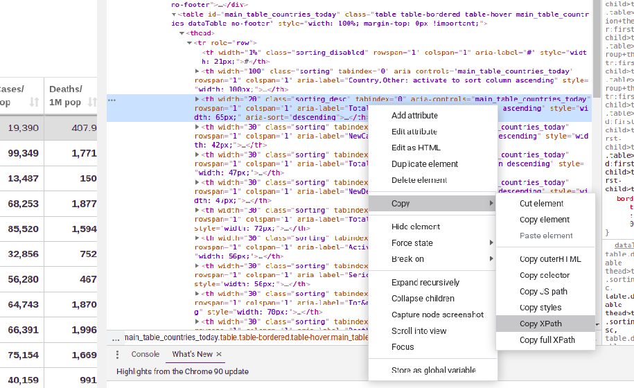

# Đào dữ liệu Corona trên trang Worldometers.info

## Ngôn ngữ:

- **Python**

## Scrapy

**_Scrapy_** là 1 framework của python cho phép ta có thể cạo dữ liệu từ web site bằng các lớp đã được định nghĩa sẵn. Scrapy có 5 thành phần.

1. Spiders:  
   _Spiders là lớp đươc định nghĩa sẵn giúp ta có thể lấy dữ liệu liệu dự trên cấu trúc của website._

2. Pipelines:  
   _Xử lý các thao tác tiền xử lý dữ liệu như: Làm sạch dữ liệu, xóa các phần tử trùng lặp._

3. Middlewares:  
   _Xử lý các request gửi đến website và các response mà ta nhận lại được._

4. Engine:  
   _Chịu trách nhiệm điều phối hoạt động của các thành phần khác._

5. Sheduler:  
   _Chịu trách nhiệm duy trì thứ tự thực hiện của các công việc_

### Cài đặt

```bash
pip install scrapy
```

### Tạo Scrapy project

```bash
scrapy startproject corona
```

### Tạo spider trong Scrapy

```bash
cd corona
scrapy genspider covid www.worldometers.info/coronavirus
```

### Lấy các dữ liệu từ worldometer

- Lấy xpath trong html  
  
- Ta lấy đường dẫn xpath của bảng dữ liệu:

```python
rows = response.xpath( '(//tbody[1])[1]//td/a[@class="mt_a"]/parent::td//parent::tr')
```

- Duyệt qua từng dòng để lấy dữ liệu (Xử dụng xpath):

```python
for row in rows:
    country = row.xpath(".//td[2]/a/text()").get()
    totalCase = row.xpath(".//td[3]/text()").get()
    newCase = row.xpath(".//td[4]/text()").get()
    totalDeath = row.xpath(".//td[5]/text()").get()
    newDeath = row.xpath(".//td[6]/text()").get()
    totalRecovered = row.xpath(".//td[7]/text()").get()
    activeCase = row.xpath(".//td[9]/text()").get()
    seriousCritical = row.xpath(".//td[10]/text()").get()
    TotalCasePer1MPop = row.xpath(".//td[11]/text()").get()
    TotalDeathsPer1MPop = row.xpath(".//td[12]/text()").get()
    TotalTests = row.xpath(".//td[13]/text()").get()
    TotalTestsPer1MPop = row.xpath(".//td[14]/text()").get()
    population = row.xpath(".//td[15]/a/text()").get()
    if population is None:
        population = row.xpath(".//td[15]/text()").get()
```

- Chuyển dữ liệu vào dataframe

```
yield {
    "CountryName": country,
    "Total Case": totalCase,
    "New Case" : newCase,
    "Total Deaths": totalDeath,
    "new Deaths": newDeath,
    "Total Recovered": totalRecovered,
    "Active Cases": activeCase,
    "Critical Cases": seriousCritical,
    "Total Case / 1M Pop": TotalCasePer1MPop,
    "Deaths / 1M Pop": TotalDeathsPer1MPop,
    "Total Tests": TotalTests,
    "Total Tests / 1M Pop": TotalTestsPer1MPop,
    "Population": population
}
```

- Xuất dữ liệu ra file CSV

```bash
scrapy crawl covid -o [CoronaData_filename].csv
```

- Bash script cạo dữ liệu theo ngày

```bash
cd corona
now=$(date +%d-%m)
scrapy crawl covid -o ../../data/"$now".csv
cd ..
```

# Tham khảo:

[Corona scraping using Scrapy](https://gaire-crisna.medium.com/corona-data-scraping-with-scrapy-python-653a78340699)
