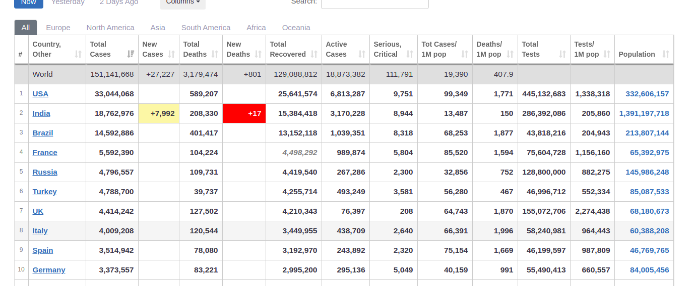

# Tiền xử lý dữ liệu [worldometer.info](../data/13-04.csv)

## Lý do tiền xử lý:

- Dữ liệu số trong bảng có chứa dấu "," khiến cho các dữ liệu số bị nhận dạng thành dữ liệu kiểu chuỗi.  
  

## Các bước tiền xử lý:

0. Lấy nhãn của các cột dữ liệu (trừ cột tên quốc gia)

```python
attrs = list(df)[1:]
```

1. Xóa các dấu "," các cell dữ liệu

```python
df[attrs] = df[attrs].replace({',':''}, regex=True)     #Remove all , in a number (Ex: 22,223,687)
```

2. Xóa các khoảng trắng dư thừa trong dữ liệu

```python
df[attrs] = df[attrs].replace({' ':''}, regex=True)     #Remove all leading space (Ex: " 22,223,687 ")
```

3. Chuyển dữ liệu kiểu chuỗi thành kiểu số

```python
df[attrs] = df[attrs].apply(pd.to_numeric)              #Convert all data to numeric
```

4. Điền 0 vào các ô dữ liệu trống

```python
df[attrs] = df[attrs].replace(np.nan, 0, regex=True)    #fill all missing value with 0
```

5. Xuất ra file output

```python
df.to_csv("../data/13-04.csv")
```
