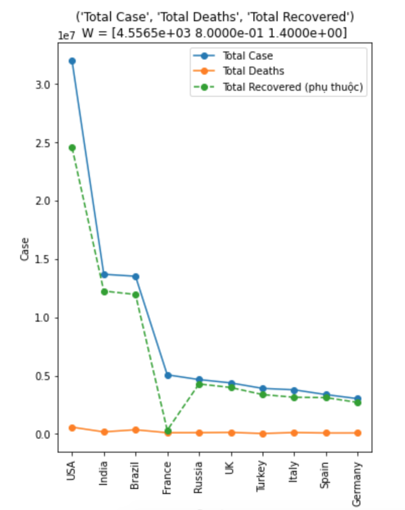

# Giải thích biểu đồ & Nhận xét dữ liệu

- Tại đây chứa phần **giải thích biểu đồ** (tại sao lại sử dụng loại biểu đồ này để visualize) và phần **nhận xét dữ liệu** (giống kiểu sách tóm tắt thống kê trang 76)

## Giải thích biểu đồ

- Lý do sử dụng **Line Chart** trong biểu diễn mối quan hệ giữa 3 biến dữ liệu và 4 biến dữ liệu

    - Sau khi tìm ta được quan hệ tuyến tính giữa 3 biến dữ liệu (bao gồm 2 biến độc lập và 1 biến phụ thuộc) và 4 biến dữ liệu (bao gồm 3 biến độc lập và 1 biến phụ thuộc), việc trực quan dữ liệu được dựa trên cơ sở toán học như sau:
        - Giả sử ta tìm được hàm hồi quy giữa 3 biến như sau: 

            $$Total Recoverd = f(Total Cases, Total Deaths) = 4556 + 0.8\times Total Cases + 1.4\times Total Deaths$$

        - Lấy đạo hàm riêng của `Total Recoverd` theo các biến độc lập, ta được 
            - $\frac{\partial{\text{ Total Recoverd}}}{\partial{\text{ Total Cases}}} = 0.8 > 0$: `Total Cases` và `Total Recovered` biến thiên đồng biến. Nghĩa là khi `Total Cases` tăng thì `Total Recovered` cũng tăng theo (xét trong trường hợp `Total Deaths` là hằng số hoặc có biến động nhưng biến động này rất nhỏ so với các biến còn lại).

            - $\frac{\partial{\text{ Total Recoverd}}}{\partial{\text{ Total Deaths}}} = 1.4 > 0$: `Total Deaths` và `Total Recovered` biến thiên đồng biến. Nghĩa là khi `Total Deaths` tăng thì `Total Recovered` cũng tăng theo (xét trong trường hợp `Total Cases` là hằng số hoặc có biến động nhưng biến động này rất nhỏ so với các biến còn lại).

        - Đối chiếu vào biểu đồ đường: Quan sát các tổng thể biểu đồ, ta thấy
            - `Total Deaths` biến động rất nhẹ so với 2 biến còn lại. Do đó, sự thay đổi của biến này không ảnh hưởng nhiều đến `Total Recovered`.
            - `Total Cases` biến động rất mạnh, và khi nó giảm/tăng thì `Total Recovered` (biến phụ thuộc) cũng giảm/tăng theo. 
            - Vậy ta đã biểu diễn được quan hệ biến thiên đồng biến giữa các biến `Total Cases` và `Total Deaths` với biến `Total Recoverd`

        

    - Tóm lại, việc sử dụng biểu đồ đường để thể hiện mối quan hệ tuyến tính giữa các biến dữ liệu được nhóm cho là hợp lý vì đã biểu diễn được sự biến thiên phụ thuộc giữa các biến phụ thuộc và biến độc lập.

- Lý do sử dụng **Biểu đồ Scatter** (Tú)
    - Sử dụng **Biểu đồ Scatter** để xác định trong một cặp 2 biến dữ liệu thì ta có thể xác định xem hai biến này có liên quan với nhau không, có liên quan nhiều hay ít và như thế nào.

- Lý do sử dụng **Stacked Bar Chart** (MP)
    - write something here

- Lý do sử dụng **World Map**
    - Sử dụng **World Map** cho ta thấy được cái nhìn tổng quan của mỗi biến dữ liệu giữa các quốc gia và thấy rõ được sự khác biệt, khác biệt như thế nào giữa các quốc gia. Đồng thời cho ta dễ dàng thấy được những nét tương đồng giữa hai biến dữ liệu giữa các quốc gia, từ đó có thể nhận định được có sự tương quan xảy ra giữa hai biến dữ liệu đang xét không.

## Nhận xét dữ liệu 

- Nhận xét dữ liệu **Line chart**
    - Tiến hành hồi quy 3 biến cho lần lượt các trường dữ liệu trong tập dữ liệu, ta thu được kết quả phân tích thống kê như sau (lấy những bộ có `Adj R^2` > 0.7). Các bộ 3 biến này tồn tại quan hệ với mức tin cậy trên 70%.

    | STT | Var1 (độc lập) | Var2 (độc lập) | Var3 (phụ thuộc) | Adj R^2 |
    |:-----:|----------------|----------------|------------------|:---------:|
    | 1   | Total Case     | Total Deaths   | Total Recovered  | 0.977   |
    | 2   | Total Case     | Total Deaths   | Active Cases     | 0.719   |
    | 3   | Total Case     | Total Deaths   | Total Tests      | 0.800   |
    | 4   | Total Case     | Total Recovered| Active Cases     | 0.967   |
    | 5   | Total Case     | Total Recovered| Total Tests      | 0.771   |
    | 6   | Total Case     | Active Cases   | Total Tests      | 0.771   |
    | 7   | Total Case     | Critical Cases | Total Tests      | 0.777   |
    | 8   | Total Deaths   | Total Recovered| Total Tests      | 0.764   |
    | 8   | Total Recovered| Active Cases   | Total Tests      | 0.772   |
    | 10  | Total Recovered| Critical Cases | Total Tests      | 0.754   |

    - Tiến hành hồi quy 4 biến cho lần lượt các trường dữ liệu trong tập dữ liệu, ta thu được kết quả phân tích thống kê như sau (lấy những bộ có `Adj R^2` > 0.7). Các bộ 4 biến này tồn tại quan hệ với mức tin cậy trên 70%.

    | STT | Var1 (độc lập) | Var2 (độc lập) | Var3 (độc lập) | Var4 (phụ thuộc) | Adj R^2 |
    |:-----:|----------------|----------------|----------------|------------------|:---------:|
    | 1   | Total Case     | Total Deaths   | Total Recovered| Active Cases     | 0.967   |
    | 2   | Total Case     | Total Deaths   | Total Recovered| Total Tests      | 0.800   |
    | 3   | Total Case     | Total Deaths   | Active Cases   | Total Tests      | 0.800   |
    | 4   | Total Case     | Total Deaths   | Critical Cases | Total Tests      | 0.800   |
    | 5   | Total Case     | Total Recovered| Active Cases   | Total Tests      | 0.771   |
    | 6   | Total Case     | Total Recovered| Critical Cases | Total Tests      | 0.776   |
    | 7   | Total Case     | Active Cases   | Critical Cases | Total Tests      | 0.777   |
    | 8   | Total Deaths   | Total Recovered| Active Cases   | Total Tests      | 0.799   |
    | 8   | Total Deaths   | Total Recovered| Critical Cases | Total Tests      | 0.763   |
    | 10  | Total Recovered| Active Cases   | Critical Cases | Total Tests      | 0.778   |

- Nhận xét dữ liệu **Stacked bar chart** (MP)
    - write something here

- Nhận xét dữ liệu **Scatter plot** (Tú)

**(Total Case, Total Deaths)**
    - Biến `Total Case` có ý nghĩa đối với mô hình về mặt thống kê (p-value = 3.27e-113)
    - Mô hình phù hợp tốt với dữ liệu quan sát về mặt thống kê (p-value = 3.27e-113)
    - Biến `Total Case` có thể giải thích được 90.52% sự thay đổi của biến `Total Deaths`
    - Phương trình hồi quy:
                *Total Deaths* = 1656.22 + *Total Case* * 0.018922

**(Total Case, Total Recovered)**
    - Biến `Total Case` có ý nghĩa đối với mô hình về mặt thống kê (p-value = 1.33e-180)
    - Mô hình phù hợp tốt với dữ liệu quan sát về mặt thống kê (p-value = 1.33e-180)
    - Biến `Total Case` có thể giải thích được 97.73% sự thay đổi của biến `Total Recovered`
    - Phương trình hồi quy:
                *Total Recovered* = 6854.67 + *Total Case* * 0.793753

**(Total Case, Total Tests)**
    - Biến `Total Case` có ý nghĩa đối với mô hình về mặt thống kê (p-value = 7.72e-72)
    - Mô hình phù hợp tốt với dữ liệu quan sát về mặt thống kê (p-value = 7.72e-72)
    - Biến `Total Case` có thể giải thích được 77.20% sự thay đổi của biến `Total Tests`
    - Phương trình hồi quy:
                *Total Tests* = 1193995.22 + *Total Case* * 12.685115

**(Total Deaths, Total Recovered)**
    - Biến `Total Deaths` có ý nghĩa đối với mô hình về mặt thống kê (p-value = 1.53e-106)
    - Mô hình phù hợp tốt với dữ liệu quan sát về mặt thống kê (p-value = 1.53e-106)
    - Biến `Total Deaths` có thể giải thích được 89.08% sự thay đổi của biến `Total Recovered`
    - Phương trình hồi quy:
                *Total Recovered* = -10871.48 + *Total Deaths* * 38.122409

**(Total Recovered, Total Tests)**
    - Biến `Total Recovered` có ý nghĩa đối với mô hình về mặt thống kê (p-value = 4.48e-68)
    - Mô hình phù hợp tốt với dữ liệu quan sát về mặt thống kê (p-value = 4.48e-68)
    - Biến `Total Recovered` có thể giải thích được 75.31% sự thay đổi của biến `Total Tests`
    - Phương trình hồi quy:
                *Total Tests* = 1273746.65 + *Total Recovered* * 15.606073

**(Total Case, Active Cases)**
    - Biến `Total Case` không đủ độ tin cậy để giải thích sự thay đổi của biến `Active Case` (71.75% < 75%)

**(Total Case, Critical Cases)**
    - Biến `Total Case` không đủ độ tin cậy để giải thích sự thay đổi của biến `Critical Cases` (65.74% < 75%)

**(Total Case, Population)**
    - Biến `Total Case` không đủ độ tin cậy để giải thích sự thay đổi của biến `Population` (16.19% < 75%)

**(Total Deaths, Active Cases)**
    - Biến `Total Deaths` không đủ độ tin cậy để giải thích sự thay đổi của biến `Active Cases` (62.11% < 75%)

**(Total Deaths, Critical Cases)**
    - Biến `Total Deaths` không đủ độ tin cậy để giải thích sự thay đổi của biến `Critical Cases` (69.78% < 75%)

**(Total Deaths, Total Tests)**
    - Biến `Total Deaths` không đủ độ tin cậy để giải thích sự thay đổi của biến `Total Tests` (61.27% < 75%)

**(Total Deaths, Population)**
    - Biến `Total Deaths` không đủ độ tin cậy để giải thích sự thay đổi của biến `Population` (10.92% < 75%)

**(Total Recovered, Active Cases)**
    - Biến `Total Recovered` không đủ độ tin cậy để giải thích sự thay đổi của biến `Active Cases` (58.06% < 75%)

**(Total Recovered, Critical Cases)**
    - Biến `Total Recovered` không đủ độ tin cậy để giải thích sự thay đổi của biến `Critical Cases` (64.40% < 75%)

**(Total Recovered, Population)**
    - Biến `Total Recovered` không đủ độ tin cậy để giải thích sự thay đổi của biến `Population` (18.41% < 75%)

**(Active Cases, Critical Cases)**
    - Biến `Active Cases` không đủ độ tin cậy để giải thích sự thay đổi của biến `Critical Cases` (45.96% < 75%)

**(Active Cases, Total Tests)**
    - Biến `Active Cases` không đủ độ tin cậy để giải thích sự thay đổi của biến `Total Tests` (56.94% < 75%)

**(Active Cases, Population)**
    - Biến `Active Cases` không đủ độ tin cậy để giải thích sự thay đổi của biến `Population` (5.3% < 75%)

**(Critical Cases, Total Tests)**
    - Biến `Critical Cases` không đủ độ tin cậy để giải thích sự thay đổi của biến `Total Tests` (44.07% < 75%)

**(Critical Cases, Population)**
    - Biến `Critical Cases` không đủ độ tin cậy để giải thích sự thay đổi của biến `Population` (19.46% < 75%)

**(Total Tests, Population)**
    - Biến `Total Tests` không đủ độ tin cậy để giải thích sự thay đổi của biến `Population` (40.36% < 75%)

- Nhận xét dữ liệu **World Map** (Sơn)

**(Total Case, Total Deaths)**
    - Phân bố dữ liệu giữa các quốc gia của 2 biến dữ liệu này có nét tương đồng nhau (R^2 = 0.9052). Điều này cho thấy hai biến dữ liệu này có tương quan với nhau

**(Total Case, Total Recovered)**
    - Phân bố dữ liệu giữa các quốc gia của 2 biến dữ liệu này có nét tương đồng nhau (R^2 = 0.9773). Điều này cho thấy hai biến dữ liệu này có tương quan với nhau

**(Total Case, Total Tests)**
    - Phân bố dữ liệu giữa các quốc gia của 2 biến dữ liệu này có nét tương đồng nhau (R^2 = 0.7721). Điều này cho thấy hai biến dữ liệu này có tương quan với nhau

**(Total Deaths, Total Recovered)**
    - Phân bố dữ liệu giữa các quốc gia của 2 biến dữ liệu này có nét tương đồng nhau (R^2 = 0.8908). Điều này cho thấy hai biến dữ liệu này có tương quan với nhau
    
**(Total Tests, Total Recovered)**
    - Phân bố dữ liệu giữa các quốc gia của 2 biến dữ liệu này có nét tương đồng nhau (R^2 = 0.7531). Điều này cho thấy hai biến dữ liệu này có tương quan với nhau